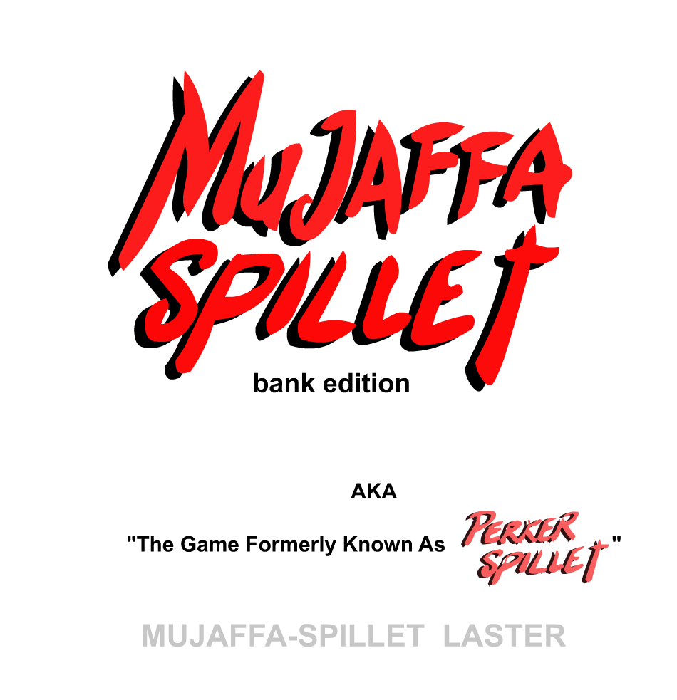
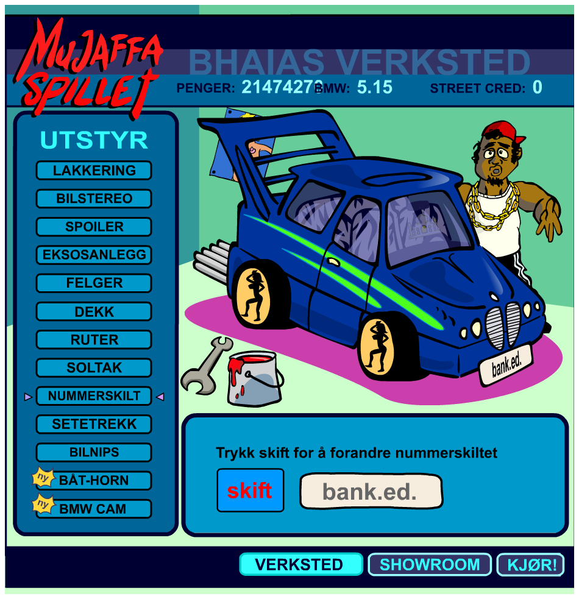

# Mujaffa Spillet Bank Edition
This is a reupload of a patched silly game from 2003 that me and my big brother used to play a lot. It Danish.

You go round in this car fucking Norwegian hookers and get street cred. I think it's made by the Norwegian government-owned radio and television public broadcasting company "nrk.no" back in the good ol' times when political correctness wasn't a thing yet.

Anyways so I patched the binary back in 2004 using Visual Basic 6 so that you start with some 2 billion NOK from the get go. Here are some screenshots:

# The loading screen

# The shop

# The patch
Essentially you look at the original binary and observe the 5000 initial NOK you get. This number is stored as a signed 32-bit integer in little endian format in the Flash binary. Search for it from the top down and replace it with something higher. Same goes with the "bank edition" text. Initially it was "version 1.6". Text is stored as C strings with a terminating 0-char.

# License
Probably abandonware
